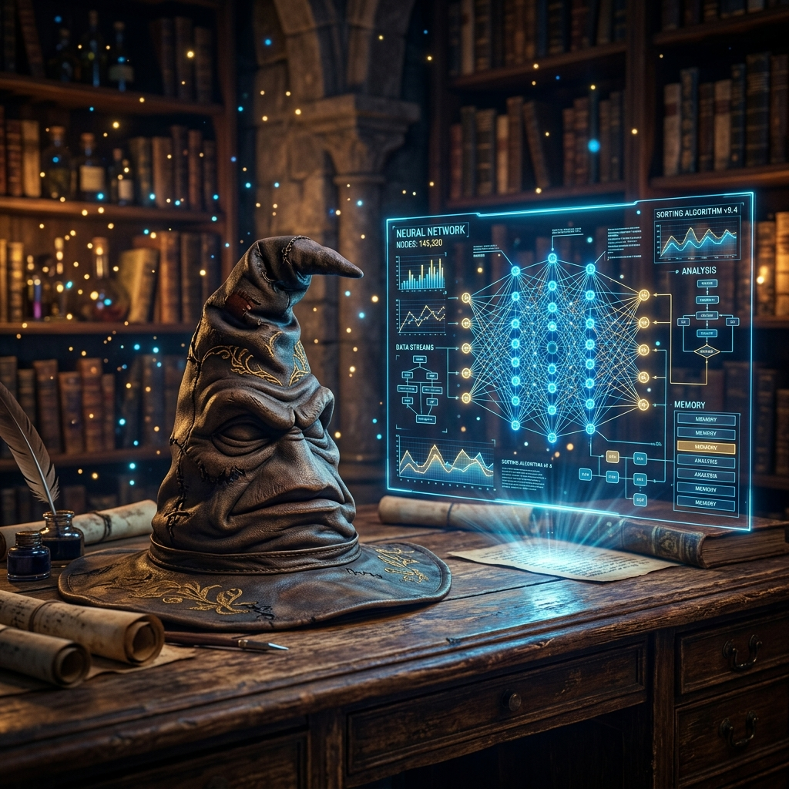

# 🪄 The AI Sorting Hat



> *"It is our choices, Harry, that show what we truly are, far more than our abilities."*
> — **Albus Dumbledore**, *Harry Potter and the Chamber of Secrets*

Welcome to the **AI Sorting Hat**! This repository is a magical playground where machine learning meets the wizarding world. Here, I implement and experiment with classification models from **Prof. S. Calderara's Artificial Intelligence course** (UNIMORE), using Hogwarts students' data to test their accuracy.

---

## 🛡️ The Quest: Sorting the Students

*"Not Slytherin, eh? Are you sure? You could be great, you know, it’s all here in your head..."* — **The Sorting Hat**

We are using the Hogwarts student body as our dataset to test different classification strategies. Which model will be the best at predicting if a student belongs in **Gryffindor**, **Hufflepuff**, **Ravenclaw**, or **Slytherin**?

### 🧪 Magical Models Included

* **⚔️ Logistic Regression (OvR):** Our first attempt at drawing boundaries between houses. Simple, yet effective for basic traits.
* **🦅 LDA (Linear Discriminant Analysis):** A generative approach that proved to be the most accurate for this specific "magical" distribution.
* **🐍 QDA (Quadratic Discriminant Analysis):** For when the sorting gets serious and we need those smooth, quadratic curves to separate the ambitious from the brave.

---

## 📜 How to Cast the Spells (Usage)

*"I solemnly swear that I am up to no good."* — **The Marauder's Map**

If you want to play with the Sorting Hat yourself, follow these steps:

1. **Clone the Repository:**

    ```bash
    git clone https://github.com/AngeLorenzo04/Cappello-Parlante-ML.git
    cd Cappello-Parlante-ML
    ```

2. **Brew your Environment:**

    ```bash
    pip install -r requirements.txt
    ```

3. **Harness the Magic:**
    Each model has its own dedicated chamber. Move into the directory and run the `main.py`:

    ```bash
    # Example for LDA
    cd LDA
    python main.py
    ```

---

## ⚠️ Important Wizarding Notice
>
> [!IMPORTANT]
> This repository is **strictly for fun**.
>
> * It is **not** an official educational resource.
> * It is **not** a formal lab submission.
> * It's simply a place where I take the "dry" math from the slides and turn it into something magical.

---

## ✨ Credits

_"Wit beyond measure is man’s greatest treasure."* — **Rowena Ravenclaw**

Built with ❤️, Python and a bit of **Liquid Luck**.

**Developed by:** Angelo Lorenzo Di Candia
